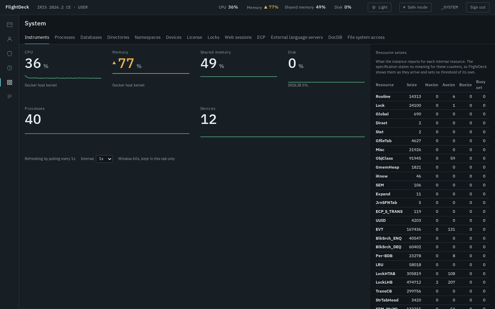
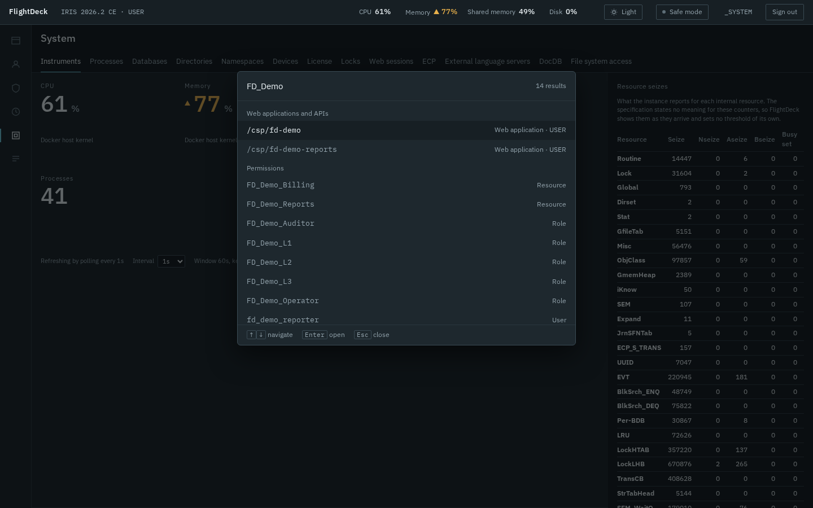
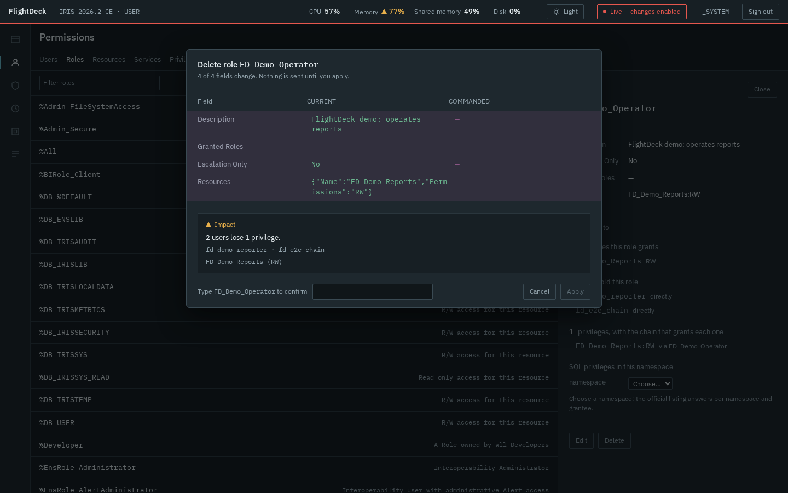

# FlightDeck for InterSystems IRIS

FlightDeck is a keyboard-first management portal for InterSystems IRIS that ships as a container you
can run in one command: you drive it from a command palette, every browser tab starts read-only, and
every change is shown to you first — the exact fields that would change and the users who would lose
access — and only applied once you confirm. It is built entirely on IRIS's official **SysAdmin API**
(the REST management API under `/api/admin`), so what you can see and do is exactly what your own
IRIS account is allowed to see and do, and your password is never stored by any part of it.



## Install

**Requirements**

- **Docker Engine 24+ with Docker Compose v2.** Linux, macOS and Windows (including WSL2).
- **About 3 GB of free disk space** for the IRIS Community image, 5 GB for IRIS for Health.
- **A free port** — 52780 by default, and any other port works (see below).
- **x86-64 or arm64.** The images are multi-architecture, so Apple Silicon runs them natively, with
  no emulation.

**One command, after cloning**

```bash
git clone https://github.com/kcedd34/iris-flightdeck.git
cd iris-flightdeck
docker compose up -d      # the install
docker compose logs -f iris
```

This pulls **`intersystemsdc/iris-community:2026.2-zpm`**, pinned in `docker-compose.yml`, and builds
a small image on top of it that adds FlightDeck. So the default install gives you the **full
portal**, not the limited mode described under [Compatibility](#compatibility) — you have to ask for
an older IRIS to get that.

Wait for this line — about 15 seconds after the first build, which itself takes a few minutes while
the base image downloads:

```text
FlightDeck is ready at http://localhost:52780/flightdeck/ — sign in with the default account documented in the README (local evaluation only).
```

Open **http://localhost:52780/flightdeck/** and sign in with `_SYSTEM` / `SYS`, the default account
of the InterSystems Community image. FlightDeck creates and changes no credential. **Use it for local
evaluation only.**

FlightDeck installs into the `USER` namespace and does not replace the InterSystems Management
Portal — it runs beside it, on the same instance, and points you back to it for the few operations it
[declines to perform](#what-flightdeck-declines-to-do).

This container also creates the [demonstration objects](#demonstration-objects), so that every screen
has something to show on first open. One of them, `/csp/fd-demo`, is **deliberately unauthenticated**
— it exists so the exposure warning has something real to point at. That is fine on a throwaway
container bound to your own machine, and it is the reason the IPM path creates nothing of the sort
unless you ask.

Then try these three, in order — they are the portal in ninety seconds:

1. Press <kbd>Ctrl</kbd>+<kbd>K</kbd> (<kbd>Cmd</kbd>+<kbd>K</kbd> on macOS — FlightDeck takes the
   shortcut from the browser while the portal has focus) and type `FD_Demo`. The demonstration
   roles, resources, web application, tasks and wallet collection appear, grouped by domain.
2. Type `delete` and press <kbd>Enter</kbd> on "Delete a role" — the palette matches against the
   names of objects and actions, so a fragment is enough. FlightDeck offers to turn off safe mode
   first, because this tab is read-only. Turn it off and choose `FD_Demo_Operator`: before anything
   happens you get the fields that would change, the users who would lose access, and a confirmation
   that asks you to type the role's name. Cancel it — nothing has been sent.
3. Open a second tab. It starts in safe mode again: safe mode is per tab and never remembered.

To stop: `docker compose down`. To remove everything including IRIS data: `docker compose down -v`.
If the ready line never appears, or sign-in refuses you, see [Troubleshooting](#troubleshooting).

**On IRIS for Health** — the same procedure, one variable. `--build` is needed here and not above
because the local image has already been built on top of IRIS Community, and changing the base means
rebuilding it:

```bash
docker compose down -v
IRIS_IMAGE=intersystemsdc/irishealth-community:2026.2-zpm docker compose up -d --build
```

**If the port is already in use**, `docker compose up -d` stops with a message like this one —
Docker's exact wording varies by version, but it always names the port:

```text
Error response from daemon: failed to set up container networking: driver failed programming
external connectivity on endpoint iris-flightdeck-iris-1: failed to bind host port
0.0.0.0:52780/tcp: address already in use
```

Pick another one. Nothing else changes, and the ready line shows the new URL:

```bash
FLIGHTDECK_PORT=52790 docker compose up -d
```

That syntax is POSIX shell. **In PowerShell or `cmd`**, or whenever you would rather not repeat the
variable, put it in a `.env` file next to `docker-compose.yml` — Compose reads it automatically:

```text
FLIGHTDECK_PORT=52790
```

### Putting it on a network

The install binds to **localhost only**. FlightDeck is an administration portal and this install
signs in with the Community image's documented default account, so on a machine with a public
address, publishing it on every interface would put full administrative access to that IRIS on the
internet. Locally nothing changes — the portal is at `http://localhost:52780/flightdeck/` either way.

If you do want it reachable from elsewhere:

```bash
FLIGHTDECK_BIND=0.0.0.0 docker compose up -d
```

Before you do, at least: change `_SYSTEM`'s password, and put it behind something that terminates
TLS. `deploy/vm/` in this repository is a worked example — a reverse proxy that forwards only
FlightDeck's own two paths and answers 404 to the rest of IRIS, an unprivileged container with no
bind mounts, and a restricted egress rule. It is what runs the public demo.

### Install with IPM on an existing instance

This path needs IPM (ZPM) already installed on the instance — the `-zpm` Community images carry it.
On IRIS 2026.2 or later (2026.1 installs in limited mode), in the namespace where you want
FlightDeck, from a clone of this repository:

```objectscript
zpm "load /path/to/iris-flightdeck"
```

This installs two web applications — `/flightdeck` for the interface and `/api/flightdeck` for the
API, with Password authentication — a role `FlightDeck_Runtime` granting read access to FlightDeck's
code database inside those two applications only, and a small capture routine in `%SYS`. Nothing else
is created or changed.

On an instance older than 2026.1 there is no SysAdmin API at all: FlightDeck installs, and sign-in
refuses with the version it detected rather than half-working.

**Demonstration objects are off by default** on this path. To add them:

```objectscript
zpm "load /path/to/iris-flightdeck -DDemo=1"
```

⚠️ **`-DDemo=1` creates `/csp/fd-demo`, a deliberately unauthenticated web application**, so that the
exposure warning has something real to point at. That is what you want on a scratch instance and not
what you want on a shared one. Without the flag, nothing of the sort is created.

The installer creates the role and every demonstration object through the SysAdmin API. The
installing user needs `%All`, or equivalent rights for the web applications and the `%SYS` routine.

## Try it without installing anything

There is a public demo at **http://109.123.244.170/**. Its credentials are printed on its own
sign-in form, and they are also here:

| | |
|---|---|
| User | `demo` |
| Password | *printed on the demo's sign-in form* |

**These are not the credentials above.** The local Docker install signs in with `_SYSTEM` / `SYS`,
the InterSystems Community image's own default. The demo instance has a different administrative
password that exists only on that machine, and the account you are given there is a separate one.

Four things are true of that demo and are worth knowing before you judge it:

- **It is rebuilt every hour**, from nothing. Anything you change is discarded, and that is
  deliberate: the account you are given holds `%All`, because permissions and security are the part
  of this portal worth looking at — the impact analysis, the last-administrator predicate, the
  dry-run with provenance — and a read-only account would hide exactly that. Recovery replaces
  restriction: a watchdog checks every five minutes that a visitor can still sign in, and rebuilds
  immediately if not.
- **It is shared.** Someone else may be looking at the same instance while you are.
- **It is plain HTTP**, with no certificate. Treat anything you type there as public. Do not use a
  password of yours on it.
- **It is a disposable machine** that runs nothing else.

If you want an instance that is yours, with nothing shared and nothing reset, the one-command install
above takes a couple of minutes.

## The six domains

- **Web applications and REST APIs** — every web application with a graded exposure marker, edited
  through a field-by-field rehearsal; every REST service the instance serves, discovered with its
  OpenAPI specification and callable from the browser.
- **Permissions** — users, roles, resources, services and privileged routines, each privilege shown
  with the chain of roles that grants it, and each removal preceded by who loses what.
- **Security and secrets** — TLS, X.509, OAuth 2.0 in its three roles, the wallet, LDAP, MFT,
  auditing, web authentication and superservers; secrets are set or replaced, never shown.
- **Tasks** — the task list with each task's recent history, run, suspend, resume and reschedule, and
  a jump from a failed run to the logs of that period.
- **Operating system** — processes, databases, directories, namespaces, devices, licence, locks, web
  sessions, ECP, external language servers, DocDB and file-system access, with a live instrument
  cluster above them.
- **Logs** — five sources in one stream under a single normalised schema, live follow, a jump from an
  event to the entity it names, and the original record behind every line.

## What makes it different

- **A command palette, not a menu tree.** <kbd>Ctrl</kbd>+<kbd>K</kbd> from anywhere finds any user,
  role, web application, task or action by name, grouped by domain, and opens it in the inspector.
  Every destination in the portal is reachable without the mouse.


- **An entity graph, not isolated forms.** Objects link to the objects they affect: a role to the
  users who hold it and the resources it grants, a web application to its roles and REST services, a
  log event to the process, namespace or user it names. You follow a question instead of re-finding
  each object by name.
- **A dry-run with impact analysis before every change.** Current and commanded values side by side,
  the effect on users when it can be determined, confirmation graded by risk — destructive changes
  ask you to type the target's name — and the server recomputes the whole preview and refuses if the
  object moved underneath you.



- **Safe mode, per tab, enforced by the server.** Every tab starts read-only, and turning it off
  applies to that tab alone — never shared, never remembered. The API rejects a change from a
  read-only tab before it reaches IRIS, so the guarantee does not depend on the interface.
- **One unified log stream, where the official API offers almost nothing.** Of the five places IRIS
  reports what happened, the SysAdmin API covers two. FlightDeck reads the audit trail and the
  journal through it, and implements the messages log, the alerts log and the interoperability event
  log natively, normalising all five into one line that keeps every original record. This is the part
  of the portal that could not be assembled from the API alone.

## Compatibility

FlightDeck needs the official **SysAdmin API** — v2 for the full portal, v1 for a reduced one — and
reads capability from the API's own declarations rather than from a version number: an operation the
instance does not offer is a disabled control with the reason on it, never a missing screen.

| IRIS version | Channel | Offered to you | Not offered by that IRIS | Declined by FlightDeck | Total |
|---|---|---|---|---|---|
| IRIS 2026.2 | `latest-cd` | 262 | 0 | 11 | 273 |
| IRIS 2026.1 | `latest` | 200 | 62 | 11 | 273 |

"Not offered by that IRIS" is what the instance's own API does not expose; "Declined by FlightDeck"
is what the portal [refuses to do](#what-flightdeck-declines-to-do) on every version. These numbers were read from a
running instance of each, and you can reproduce them on yours:

```bash
curl -s -u _SYSTEM:SYS -H 'X-FlightDeck-Tab: check' \
  http://localhost:52780/api/flightdeck/v1/session | grep -o '"capabilitySummary":{[^}]*}'
```

(The `v1` there is FlightDeck's own API version, not the SysAdmin API's. The header can be any
string: FlightDeck's API requires each browser tab to identify itself, which is how safe mode is
scoped to one tab.)

IRIS for Health Community Edition 2026.2 reports the same numbers as IRIS 2026.2.

**Implemented is not the same as exercised.** Of the 268 operations across the six domains, 138 are
executed by a test that then reads the result back from the instance through the official API, 91 are
exempt by name with a written reason, and 39 have no such test yet — which is why
`check-functional-coverage` is red. The breakdown, operation by operation, is in
[`verification/functional-coverage.md`](verification/functional-coverage.md).

**IRIS 2026.1 runs in limited mode.** That release — still the `latest` tag of the Community images —
exposes API v1 only. FlightDeck translates what v1 offers, shows a persistent **Limited** indicator,
and disables the rest with the reason on each control. Namespaces are still browsable, read through a
native provider because v1 has no endpoint for them.

An instance with no SysAdmin API at all refuses sign-in and says so, naming the version it detected.

**Why disabled controls name a version, if nothing checks one.** FlightDeck never asks the instance
what release it is in order to decide what to offer: it asks the API what it declares, and an
operation that is absent is disabled. The *sentence* on the disabled control names the release that
first shipped the operation, because "Requires IRIS 2026.2" is more useful to a reader than "this
instance does not declare this operation". The version is in the message, not in the decision.

## The REST test executor

- **Confined to this instance.** A test request names a method, a path, query parameters, headers and
  a body. Scheme, host and port always come from the instance serving FlightDeck. Paths carrying a
  scheme, a host, `..` segments (plain or percent-encoded) or backslashes are refused, and so are
  `Authorization`, `Cookie`, `Proxy-Authorization` and `Host` headers. **The executor is not an
  outbound proxy**: it opens no network connection at all. The request is dispatched in-process to
  the REST application that serves the path.
- **Runs as you.** The request runs with your IRIS identity, in the application's namespace, and only
  if the application is enabled and you hold its resource. Your roles are kept or reduced, never
  raised: when an application grants extra roles to real callers, a test request does not receive
  them, and the result can differ from a real call. The explorer says so before and after running.
- **Safe mode applies.** `GET`, `HEAD` and `OPTIONS` run directly. `POST`, `PUT`, `PATCH` and
  `DELETE` are refused by the server while the tab is read-only; otherwise they open the shared
  confirmation showing exactly what will be sent, and are recorded in the session trail.
- **Copy as curl** produces a command targeting this instance, carrying the literal placeholder
  `-u '<user>:<password>'` and never your credentials.

## What FlightDeck declines to do

Eleven official operations are implemented nowhere in FlightDeck **by decision**, on every version.
They appear as disabled controls stating the reason and the native path that performs them, and
`docs/api-coverage.md` lists them as declined. They share one property: the portal can neither
rehearse them nor undo them.

- **Encryption writes — 8 operations.** Creating an encryption key file, adding or removing its
  administrators, adding or removing keys, activating and deactivating a key, and changing the
  encryption settings. A mistake here can make an instance's data permanently unreadable, and a
  deleted key cannot decrypt what it encrypted. Native path: *System Administration > Encryption*.
- **Destructive storage writes — 3 operations.** Truncating a database directory, deleting a
  database, and deleting a namespace. FlightDeck creates databases and namespaces but deletes
  neither, because deletion removes data with no recovery from the portal and no safe way to show you
  first what it would cost. Native path: *System Administration > Configuration > Local Databases* and
  *> Namespaces*.

**The journal is a different decision, and a more interesting one.** Three of the five log sources
exist precisely because the official API offers nothing for them, so a missing operation is normally
a candidate for a native provider. The journal is where that stops. On IRIS 2026.1 the journal
operations are withheld by the platform, and FlightDeck does **not** read journal records natively to
fill the gap:

> FlightDeck does not read the journal natively: filtering records by the databases you can read is
> an authorization decision that belongs to IRIS.

Implementing it would mean the portal deciding which records you may see. That decision belongs to
the platform, so on that version the journal source says why it is absent and the other four keep
streaming.

## Demonstration objects

Created on the Docker install, and with `-DDemo=1` on IPM. Every object is created through the
SysAdmin API, and re-running creates no duplicates.

| Kind | Name |
|---|---|
| Resources | `FD_Demo_Reports`, `FD_Demo_Billing` |
| Roles | `FD_Demo_Operator`, `FD_Demo_Auditor` |
| Web application | `/csp/fd-demo`, intentionally unauthenticated so the exposure warning has something to show |
| Tasks | `FD Demo daily no-op`, `FD Demo nightly no-op`, `FD Demo failing task` (fails on purpose) |
| Wallet collection | `FD_Demo_Vault` (no secrets) |

## How sign-in and safe mode work

- **Credentials.** The sign-in form sends your username and password to IRIS once, in an HTTP Basic
  header. IRIS authenticates you and keeps its own session cookie. FlightDeck never stores, caches or
  logs the password, and uses no JWT or refresh token. Invalid credentials always produce the same
  message, whether or not the user exists.
- **What you can do.** Every SysAdmin API operation declares the privilege it needs (for example
  `%Admin_Secure:U`). FlightDeck crosses those declarations with the privileges IRIS reports for you.
  Actions you cannot perform stay visible, disabled, with the privilege to ask for.
- **Safe mode.** Safe mode lives in the tab's memory only — not in cookies, storage or the URL — so
  reloads, new tabs and duplicated tabs always start read-only. Every request carries the tab's
  state, and the FlightDeck API rejects any change request from a read-only tab before it reaches
  IRIS.
- **Changes.** Every change opens the same confirmation: current and commanded values side by side,
  graded confirmation, and the effect on users when it can be determined. The server recomputes the
  preview and refuses if the object changed in the meantime. FlightDeck refuses changes that would
  disable its own applications or remove the last administrative access to the instance.
- **Session trail.** Applied, failed and blocked changes are recorded in a trail you can open from
  the confirmation view or the palette and export as JSON. It is local to the browser tab, holds no
  secret values, and does **not** replace IRIS auditing.
- **Users without administrative privileges** cannot open a session. FlightDeck lists the privileges
  they would need.

## What the permissions screens claim, and what they do not

- **Every privilege comes with its origin.** A privilege is never shown without the chain of roles
  that grants it, and a chain FlightDeck could not expand is reported as not expanded, not omitted.
- **Delegated access and LDAP are not enumerated.** The official API does not report which roles an
  account receives from them, so FlightDeck marks the account and says it does not manage them there.
- **SQL privileges are read as the platform reports them.** The official listing already resolves
  provenance through roles (`Role:<name>`, `Owner Privilege`), so FlightDeck renders that and does
  not compute a second answer.
- **Before a change that could remove administrative access**, FlightDeck checks whether any enabled,
  unexpired account would still hold `%Admin_Secure:USE` or the `%All` role. If it can read what it
  needs and the answer is none, the change is refused, and the reason says what was counted. If it
  cannot read what it needs, it does not refuse and does not pretend: it says the check was
  incomplete, names what it could not read, and asks for the reinforced confirmation. The session
  trail records which of the two happened.

## Secrets

- **Secret material is write-only** everywhere: wallet secrets, private keys, client secrets,
  passwords and tokens are set, replaced or deleted. No screen, API answer, session trail or log of
  FlightDeck carries a value, and the wallet has no operation that reads one back.
- **Auditing.** FlightDeck changes the setting and performs the two writes that touch the audit trail
  — copying records to another namespace, and purging them. A purge asks for the maximum confirmation
  and states that it erases the instance's own audit trail. Reading audit records belongs to the logs
  screens.

## What the log stream reads, and what it does not

- **Five sources, one schema.** Two come from the official API — the audit trail and the journal,
  both read asynchronously; three have no API and are read natively: the instance's messages log, its
  alerts log, and the interoperability event log.
- **The original record is always kept.** Normalisation discards nothing, so an event either shows
  you the record it came from, or — when that record can no longer be recovered, a purged journal
  file or a rotated log — says so in the record's place and keeps the fields FlightDeck read before
  it went. Those two are the only cases: nothing is ever invented to fill the gap.
- **Severity is mapped, never guessed.** The scale is `info`, `warning`, `error`, `fatal`. Each
  source states its own level and FlightDeck maps it onto that scale. A source that states no level
  gets a fifth value, `unknown`, which sits outside the ordering — not `info`, and never a guess from
  the words in the message. The minimum-severity filter says how it treats it.
- **Big files are read backwards, in pages.** A log is never read whole, at any size: each page seeks
  to an offset near the end and reads one bounded window. A 100 MB file pages at the same cost as a
  small one, wherever in it you are.
- **A source that cannot be read says why, and the others keep streaming.** A stock instance writes no
  alerts log, so that source is normally absent and explains what an alerts log is and where it comes
  from.
- **What it is not.** FlightDeck does not store, index or forward any event: nothing is persisted, and
  the live window lives in the browser. It is a reader, not a log platform.

## Where FlightDeck uses Embedded Python, and why

One class: `FlightDeck.Native.HostMetrics`, the provider that reads host CPU and host memory. It is
written in Embedded Python because **reading `/proc/stat` and `/proc/meminfo` is filesystem access
and text parsing**, which is Python's natural work and not ObjectScript's.

This is not a feature added to use a language. It is the same reading, moved to the language that
suits it, and the move paid for itself in the only way that counts — code removed:

| Before, in ObjectScript | After, in Embedded Python |
|---|---|
| A sequential device opened by hand, read line by line, with the device closed and `$io` restored in every path — because `%Stream.FileCharacter` reads nothing from procfs, where every file reports size 0 | `with open(path) as handle: …` |
| `$piece`/`$zstrip` walking the text with whitespace collapsed by a `"<=>W"` strip | `str.split()` and `str.partition(":")` |
| A whole `ReadFile` helper whose only reason to exist was that workaround | Deleted |

**What stayed in ObjectScript**, deliberately: the `%Status` contract its callers expect, the previous
CPU sample held in the session, and the arithmetic — because the published percentages are rounded
with `$normalize`, and moving that would have changed values that are checked against `free` and
`top`. Python reads and parses; ObjectScript keeps what is its own.

**No version is tested anywhere in it.** Embedded Python needs IRIS 2021.2 or later, far below the
2026.1 FlightDeck itself requires, so any instance that can run this portal has it. And if the Python
runtime should fail regardless, every entry point degrades through the status the class already
returned: the vital is marked unavailable with its reason, like any other capability that is absent,
and the screen does not break.

Everything else — the log readers, the REST executor, the whole domain layer — remains ObjectScript,
because none of it is filesystem or text work.

## Day-1 platform verification

`scripts/verify/verify_platform.py` checks, in order, the eight platform facts FlightDeck depends on:
SysAdmin API v2; which sign-in path works without storing credentials; monitor data shapes;
asynchronous database metrics; the wallet; the REST management API; log file locations and the
interoperability log; and auditing.

Each fact is classified `confirmed_present`, `confirmed_absent` or `inconclusive`, with the raw
response recorded. You do not need to run it — the reports it produced are committed — but if you
want to:

```bash
scripts/verify/run-both-images.sh
```

It needs Python 3, **starts and removes its own throwaway containers** on ports of its own, and does
not touch the install you are running or the data in it.

Reports are written to `verification/<product>-<version>.json`. Exit code `0` when nothing is
inconclusive, `1` otherwise, `2` for a usage error. The committed reports and findings are in
[`verification/`](verification/).

## Checking what this README claims

Every assertion here is enforced somewhere, because a claim nobody can check is a claim that drifts.

| Claim | Where it is enforced |
|---|---|
| The operation counts, and that every operation is implemented or declined for a stated reason | `scripts/build/check-coverage.py`, in the build: it fails naming any operation of a shipped domain that no code reaches and no policy declines, and it keeps no list of tolerated gaps |
| That an implemented operation has actually been executed, with its effect read back from the instance | `scripts/build/check-functional-coverage.py`, run after the end-to-end suite: it reads the record those tests write and fails naming every operation no test executed with an independent read-back. It is red today, on purpose — see [`verification/functional-coverage.md`](verification/functional-coverage.md) |
| This README's own structure and numbers | `scripts/build/check-readme.py`, in the build |
| No credential stored, cached or logged; no secret in any response, trail or export | `frontend/e2e/audit.spec.ts` and `secrets.spec.ts` sweep the responses and the exports; `scripts/build/check-secrets.py` fails on an undeclared secret field |
| Safe mode is enforced by the server, not the interface | `scripts/dev/check-safe-mode-enforcement.sh` sends every mutating route directly, bypassing the interface, and requires each to be refused |
| Every mutation goes through the one confirmation path | `npm run check:mutation-boundary` and `scripts/dev/check-mutation-enforcement.sh` |
| The REST executor opens no outbound connection | `frontend/e2e/rest-confinement.spec.ts` |
| A 100 MB log pages at constant cost | Measured and recorded in `verification/feature-005-signoff.md` |
| It runs on both Community images, from clean | `verification/install-runs.md`, one entry per install |

## Troubleshooting

- **The ready line never appears.** Look for a line starting with `FLIGHTDECK INSTALL FAILED:` in
  `docker compose logs iris`. It names the step and the IRIS error. IRIS stays running so you can
  inspect it.
- **Sign-in says "Not available on this IRIS version or edition. Requires IRIS 2026.1."** The
  instance has no SysAdmin API at all. Use the pinned images, or upgrade.
- **The top bar shows "Limited".** The instance is IRIS 2026.1, for example a `latest` Community
  image. Disabled actions say "Requires IRIS 2026.2"; use the pinned images for the full portal.
- **Sign-in says "Invalid credentials".** The default account is `_SYSTEM` / `SYS` on the Docker
  install. On an existing instance, use your own IRIS account.
- **Sign-in says "Requires Use on …".** The account has no administrative privilege. Grant one of the
  listed `%Admin_*` resources, for example through the `%Operator` or `%Manager` role.

## Development

| Area | Command |
|---|---|
| Frontend dev server (proxies the API to the Docker install) | `cd frontend && npm ci && npm run dev`, then open http://localhost:5173/flightdeck/ |
| Frontend checks | `npm run lint && npm run check:tokens && npm run check:dialect && npm run contrast && npm run test` |
| End-to-end tests (Docker install running) | `npx playwright install chromium && npm run e2e` |
| Backend unit tests (inside the container) | `docker compose exec iris iris session iris -U USER`, then `zpm "iris-flightdeck test"` |
| Rebuild the committed frontend bundle | `cd frontend && npm run build` (verify with `scripts/build/check-dist.sh`) |
| Regenerate the capability map from the official spec | `python3 scripts/build/gen-capability-spec.py` (verify with `scripts/build/check-generated.sh`) |
| Regenerate the documentation images | `cd frontend && FD_CAPTURE=1 npx playwright test --project=docs` |

Specifications, plans and research for all six features live in [`specs/`](specs/). The project
constitution is in [`.specify/memory/constitution.md`](.specify/memory/constitution.md).

## The idea behind it

FlightDeck implements an idea published on the InterSystems Ideas Portal:
<!-- idea-link-pending --> _link to be added by the author before submission_.

## License

MIT. See [LICENSE](LICENSE).
