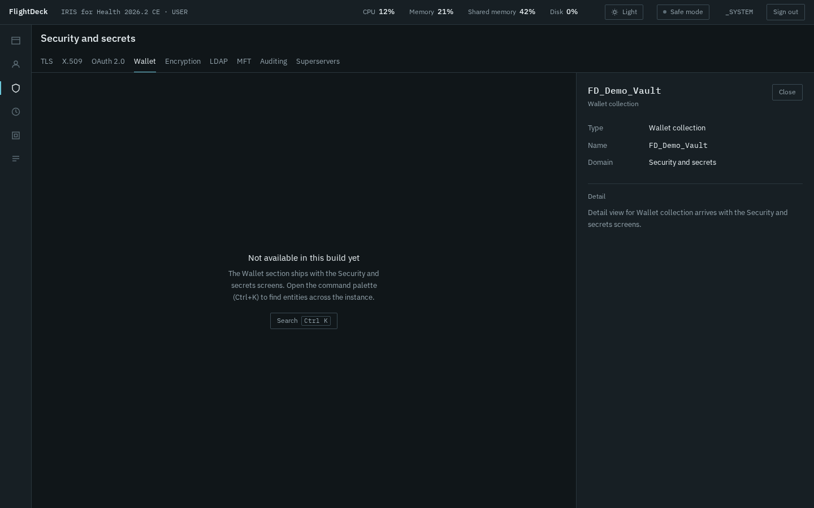

# FlightDeck for InterSystems IRIS

A keyboard-first, safe-by-default management portal for InterSystems IRIS, built entirely on the
official **SysAdmin API** (`/api/admin/v2`).



- **Command palette.** Press <kbd>Ctrl</kbd>+<kbd>K</kbd> (<kbd>Cmd</kbd>+<kbd>K</kbd> on macOS) and
  type the name of any user, role, web application, task or action.
- **Safe mode by default.** Every browser tab starts read-only. Changes need an explicit
  "Turn off safe mode", scoped to that tab only, and the server enforces it too.
- **Your IRIS identity, nothing stored.** You sign in with your IRIS account. FlightDeck keeps no
  password or token anywhere. What you can do comes from the privileges the SysAdmin API declares
  for each operation.
- **Real host telemetry.** CPU and memory come from the host; IRIS shared memory and database usage
  come from the SysAdmin API.

> This release is the **foundation**: sign-in, safe mode, command palette, instance telemetry,
> installation and the full navigation shell. The six domain screens (web applications, permissions,
> security, tasks, system, logs) are being built on top of it. Their routes already exist and
> explain what is coming.

Related idea on the InterSystems Ideas Portal: _link pending publication by the author_

---

## Requirements

- **Docker Engine 24+ with Docker Compose v2.** Works on Linux, macOS and Windows (including WSL2).
- **About 3 GB of free disk space** for the IRIS Community image (5 GB for IRIS for Health).
- **Free port 52780**, or pick another one (see [Port already in use](#port-already-in-use)).
- **IRIS 2026.2 or later for the full portal.** FlightDeck uses SysAdmin API **v2**, which first
  ships in IRIS 2026.2, so the install pins the `2026.2` images for you.
- **IRIS 2026.1 runs in limited mode.** That release (still the `latest` tag of the Community
  images) only has API v1. FlightDeck translates what v1 offers, shows a **Limited**
  indicator at the top, and disables the 64 operations it cannot offer (databases, ECP, namespace
  changes, the journal and a few more), each with its reason. Namespaces can still be browsed.

## Quick start

```bash
git clone <repository-url> iris-flightdeck
cd iris-flightdeck
docker compose up -d
docker compose logs -f iris
```

Wait for this line (about 15 seconds after the image is downloaded):

```text
FlightDeck is ready at http://localhost:52780/flightdeck/ — sign in with the default account documented in the README (local evaluation only).
```

Open **http://localhost:52780/flightdeck/** and sign in:

| Username | Password |
|---|---|
| `_SYSTEM` | `SYS` |

This is the default account of the InterSystems Community image. FlightDeck does not create or
change any credential. **Use it for local evaluation only.**

Then try:

1. Press <kbd>Ctrl</kbd>+<kbd>K</kbd> and type `FD_Demo`. The demonstration roles, resources, web
   application, tasks and wallet collection appear, grouped by domain.
2. Type `delete a role` and press <kbd>Enter</kbd>. FlightDeck offers to turn off safe mode first,
   because this tab is read-only.
3. Open a second tab. It starts in safe mode again: safe mode is per tab and never remembered.

To stop: `docker compose down`. To remove everything, including IRIS data: `docker compose down -v`.

### IRIS for Health

Same procedure, one variable:

```bash
docker compose down -v
IRIS_IMAGE=intersystemsdc/irishealth-community:2026.2-zpm docker compose up -d --build
```

### Port already in use

If port 52780 is taken, `docker compose up -d` stops with:

```text
Error response from daemon: failed to set up container networking: … Bind for 0.0.0.0:52780 failed: port is already allocated
```

Pick another port:

```bash
FLIGHTDECK_PORT=52790 docker compose up -d
```

The ready line in the log shows the new URL.

## Install with IPM on an existing instance

On IRIS 2026.2 or later (2026.1 installs in limited mode), in the namespace where you want FlightDeck, from a clone of this
repository:

```objectscript
zpm "load /path/to/iris-flightdeck"
```

This installs:
- two web applications, `/flightdeck` (the interface) and `/api/flightdeck` (the API, Password
  authentication);
- a role `FlightDeck_Runtime`, which grants read access to FlightDeck's code database only, inside
  those two web applications;
- a small capture routine, also installed in `%SYS`.

Nothing else is created or changed. **Demonstration objects are off by default.** To add them:

```objectscript
zpm "load /path/to/iris-flightdeck -DDemo=1"
```

The installer creates the role and every demonstration object through the SysAdmin API. The
installing user needs `%All` (or equivalent) for the web applications and the `%SYS` routine.

## Demonstration objects

Created on the Docker install, and with `-DDemo=1` on IPM. Every object is created through the
SysAdmin API, and re-running creates no duplicates.

| Kind | Name |
|---|---|
| Resources | `FD_Demo_Reports`, `FD_Demo_Billing` |
| Roles | `FD_Demo_Operator`, `FD_Demo_Auditor` |
| Web application | `/csp/fd-demo`, intentionally unauthenticated so the exposure warning has something to show |
| Tasks | `FD Demo daily no-op`, `FD Demo nightly no-op`, `FD Demo failing task` (fails on purpose) |
| Wallet collection | `FD_Demo_Vault` (no secrets) |

## How sign-in and safe mode work

- **Credentials.** The sign-in form sends your username and password to IRIS once, in an HTTP
  Basic header. IRIS authenticates you and keeps its own session cookie. FlightDeck never stores,
  caches or logs the password, and uses no JWT or refresh token. Invalid credentials always produce
  the same message, whether or not the user exists.
- **What you can do.** Every SysAdmin API operation declares the privilege it needs (for example
  `%Admin_Secure:U`). FlightDeck crosses those declarations with the privileges IRIS reports for
  you. Actions you cannot perform stay visible, disabled, with the privilege to ask for.
- **Safe mode.** Safe mode lives in the tab's memory only. It is not in cookies, storage or the URL,
  so reloads, new tabs and duplicated tabs always start in safe mode. Every request carries the
  tab's state, and the FlightDeck API rejects any change request from a tab in safe mode before it
  reaches IRIS.
- **Users without administrative privileges** cannot open a session. FlightDeck lists the
  privileges they would need.

## Day-1 platform verification

`scripts/verify/verify_platform.py` checks, in order, the eight platform facts FlightDeck depends
on:
1. SysAdmin API v2;
2. which sign-in path works without storing credentials;
3. monitor data shapes;
4. asynchronous database metrics;
5. wallet;
6. the REST management API;
7. log file locations and the interoperability log;
8. auditing.

Each fact is classified `confirmed_present`, `confirmed_absent` or `inconclusive`, with the raw
response recorded. To run it against fresh IRIS Community and IRIS for Health containers:

```bash
scripts/verify/run-both-images.sh
```

Reports are written to `verification/<product>-<version>.json`. Exit code: `0` when nothing is
inconclusive, `1` otherwise, `2` for a usage error. The committed reports and findings are in
[`verification/`](verification/).

## Troubleshooting

- **The ready line never appears.** Look for a line starting with `FLIGHTDECK INSTALL FAILED:` in
  `docker compose logs iris`. It names the step and the IRIS error. IRIS stays running so you can
  inspect it.
- **Sign-in says "Not available on this IRIS version or edition. Requires IRIS 2026.1."** The
  instance has no SysAdmin API. Use the pinned images or upgrade.
- **The top bar shows "Limited".** The instance is IRIS 2026.1 (for example a `latest`
  Community image). Disabled actions say "Requires IRIS 2026.2"; use the pinned images for the
  full portal.
- **Sign-in says "Invalid credentials".** The default account is `_SYSTEM` / `SYS` on the Docker
  install. On an existing instance, use your own IRIS account.
- **Sign-in says "Requires Use on …".** The account has no administrative privilege. Grant one of
  the listed `%Admin_*` resources, for example through the `%Operator` or `%Manager` role.

## Development

| Area | Command |
|---|---|
| Frontend dev server (proxies the API to the Docker install) | `cd frontend && npm ci && npm run dev`, then open http://localhost:5173/flightdeck/ |
| Frontend checks | `npm run lint && npm run check:tokens && npm run check:dialect && npm run contrast && npm run test` |
| End-to-end tests (Docker install running) | `npx playwright install chromium && npm run e2e` |
| Backend unit tests (inside the container) | `zpm "iris-flightdeck test"` |
| Rebuild the committed frontend bundle | `cd frontend && npm run build` (verify with `scripts/build/check-dist.sh`) |
| Regenerate the capability map from the official spec | `python3 scripts/build/gen-capability-spec.py` (verify with `scripts/build/check-generated.sh`) |

Specifications, plan and research live in [`specs/001-foundation-shell/`](specs/001-foundation-shell/).
The project constitution is in [`.specify/memory/constitution.md`](.specify/memory/constitution.md).

## License

MIT. See [LICENSE](LICENSE).
